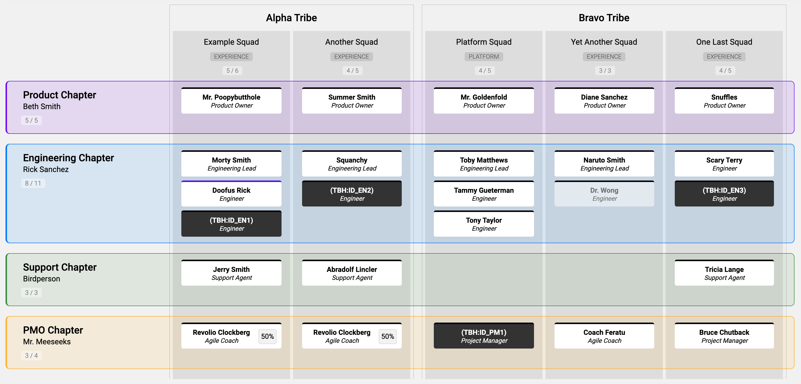

# ngx-role-map-explorer

This is a quick-and-dirty rendering tool to plan a functional org chart in the
[Spotify model](https://www.atlassian.com/agile/agile-at-scale/spotify). It uses a single JSON file as data store which
uses the below-described schema.



You can click on most entities to apply filters to that entity (Chapter, Tribe, Squad, Member, etc.) or use the filters
in the top toolbar to apply additional filters.

## Usage

To run the application, run `npm run start` from the project root.

## Map Data

The entire map schema is defined in `.map.schema.json` in the repository root.

A map contains two keys in the root object:

```json
{
  "chapters": [],
  "tribes": []
}
```

### Chapters

Chapters consist of a name (to which "Chapter" is suffixed), the name of a leader, and a hex RGB color (without the `#`
prefix):

```json
{
  "name": "Product",
  "leader": "Beth Smith",
  "color": "7700FF"
}
```

### Tribes and Squads

Tribes have a name, and a nested array of Squads, which in turn have a name, type, and nested array of members.

```json
{
  "name": "Alpha",
  "squads": [{
    "name": "Example",
    "type": "Experience",
    "members": [{
      "name": "Morty Smith",
      "role": "Engineering Lead",
      "chapter": "Engineering"
    }]
  }]
}
```

Members have a name, role, and chapter assignment. The chapter assignment must match the name of a Chapter in order to
be correctly rendered.

```json
{
  "name": "Jerry Smith",
  "role": "Support Agent",
  "chapter": "Support"
}
```

There are additional optional properties on the member object which affect rendering:

- `contractor` (`boolean`) – filterable, denotes whether or not the member is a contractor
- `vacant` (`boolean`) - filterable, denotes whether the role is currently vacant or filled
- `future` (`boolean`) - denotes whether or not the role is currently being serviced by that member
